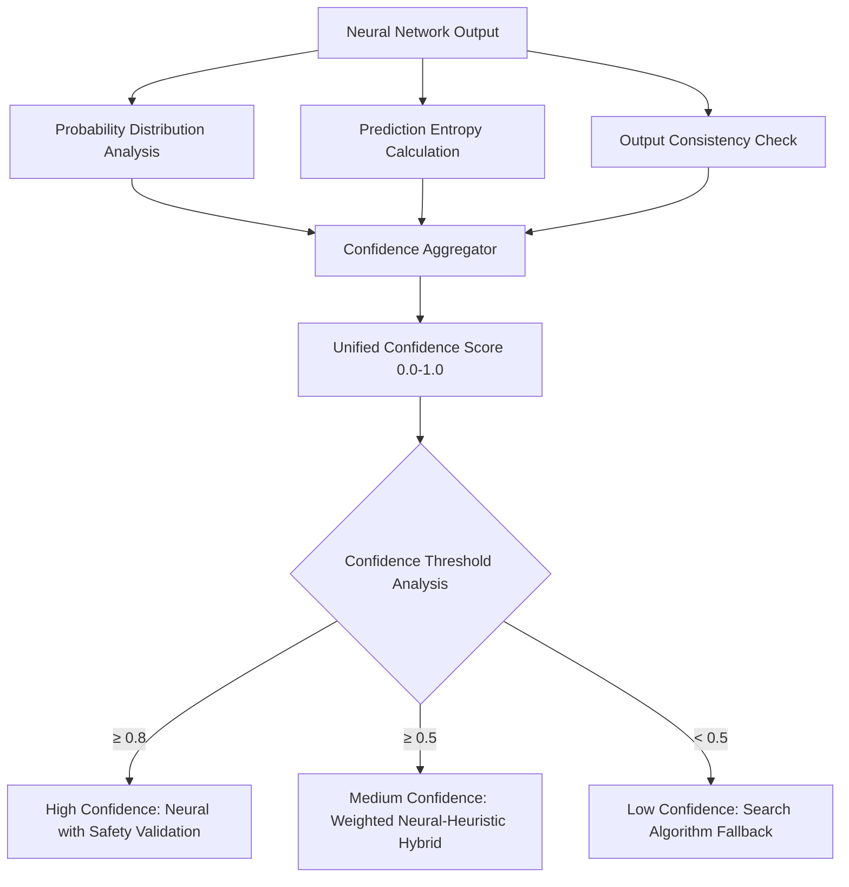
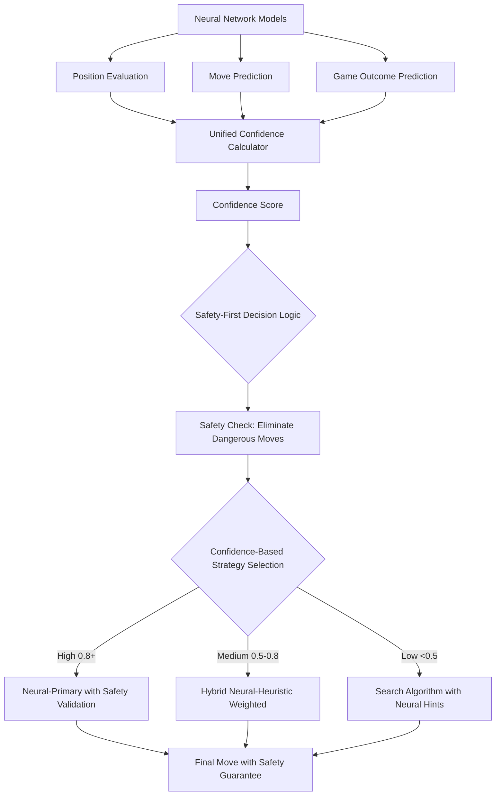

# Neural Network Confidence System Architecture

## Executive Summary

**Problem Identified**: Neural networks are functionally working and providing 7.6% performance improvements, but the confidence calculation system is fundamentally broken. The system uses heuristic-based confidence scores instead of measuring actual neural network prediction certainty, leading to suboptimal decision-making.

**Root Cause**: Three inconsistent confidence calculation methods exist, with the primary `estimate_confidence()` function using game state heuristics rather than neural network output distributions.

**Solution**: Redesign the confidence system to measure actual neural network prediction certainty through probability distributions, entropy analysis, and prediction consistency metrics.

## Current System Analysis

### Existing Architecture Problems

1. **Multiple Inconsistent Confidence Systems**:
   - `neural_network_integration.rs`: Heuristic-based (health + safety + board complexity)
   - `simple_neural_integration.rs`: Prediction-certainty based (max probability approach)  
   - Logic inconsistencies between implementations

2. **Dangerous Override Behavior**:
   - Confidence ≥ 0.30: Complete safety bypass (extremely dangerous)
   - Confidence ≥ 0.25: Neural with safety validation
   - Confidence < 0.25: Fallback to search algorithms

3. **Non-Neural Confidence Calculation**:
   ```rust
   // Current broken approach in neural_network_integration.rs
   health_confidence * 0.4 + safety_confidence * 0.4 + board_complexity_confidence * 0.2
   ```
   This measures game state, NOT neural network prediction quality!

## Proposed Architecture

### 1. Unified Neural Confidence System



### 2. Neural Network Confidence Calculation Methods

#### A. Prediction Entropy Method
```rust
fn calculate_entropy_confidence(probabilities: &[f32]) -> f32 {
    let entropy = -probabilities.iter()
        .filter(|&&p| p > 0.0)
        .map(|&p| p * p.ln())
        .sum::<f32>();
    
    let max_entropy = (probabilities.len() as f32).ln(); // Uniform distribution entropy
    1.0 - (entropy / max_entropy) // Higher confidence = lower entropy
}
```

#### B. Maximum Probability Method (Improved)
```rust
fn calculate_max_prob_confidence(probabilities: &[f32]) -> f32 {
    let max_prob = probabilities.iter().fold(0.0, |a, &b| a.max(b));
    let uniform_prob = 1.0 / probabilities.len() as f32;
    
    // Scale from uniform random (0.0) to perfect certainty (1.0)
    ((max_prob - uniform_prob) / (1.0 - uniform_prob)).max(0.0)
}
```

#### C. Output Distribution Consistency
```rust
fn calculate_consistency_confidence(
    position_eval: f32,
    move_probs: &[f32], 
    outcome_prob: f32
) -> f32 {
    // Measure consistency between different model outputs
    // High position evaluation should correlate with high outcome probability
    // Strong move preference should align with positive position evaluation
    
    let position_outcome_consistency = 1.0 - (position_eval - (outcome_prob * 2.0 - 1.0)).abs();
    let move_position_consistency = calculate_move_position_alignment(move_probs, position_eval);
    
    (position_outcome_consistency + move_position_consistency) / 2.0
}
```

### 3. Redesigned Decision Flow Architecture



### 4. Safe Override Mechanism

**KEY PRINCIPLE**: Never bypass safety checks, regardless of confidence level.

```rust
pub fn safe_neural_decision(
    neural_move: Move,
    confidence: f32,
    safe_moves: &[Move],
    game_state: &GameState
) -> Move {
    // ALWAYS validate safety first
    if !safe_moves.contains(&neural_move) {
        log::warn!("Neural network suggested unsafe move {} with confidence {}, using fallback", 
                  neural_move, confidence);
        return fallback_decision(safe_moves, game_state);
    }
    
    // Apply confidence-based decision logic only after safety validation
    match confidence {
        c if c >= 0.8 => neural_move, // High confidence, safety validated
        c if c >= 0.5 => hybrid_decision(neural_move, safe_moves, game_state, c),
        _ => search_based_decision(safe_moves, game_state)
    }
}
```

## Implementation Phases

### Phase 1: Confidence System Foundation
- **Analyze existing ONNX model outputs**: Collect probability distributions from current models
- **Design unified confidence calculation**: Implement entropy, max-probability, and consistency methods
- **Create validation framework**: Correlate confidence scores with actual game outcomes

### Phase 2: Decision Logic Redesign  
- **Redesign safety-first architecture**: Ensure safety validation occurs before all confidence-based decisions
- **Implement empirical threshold calibration**: Use real game data to determine optimal confidence thresholds
- **Replace inconsistent confidence methods**: Unify all confidence calculations under single system

### Phase 3: Monitoring and Optimization
- **Add comprehensive metrics**: Track confidence scores, decision paths, and outcomes
- **Create confidence validation tests**: Ensure edge cases and threshold behaviors work correctly
- **Benchmark performance improvements**: Validate that proper confidence usage improves game outcomes

## Technical Specifications

### New Confidence Data Structures

```rust
#[derive(Debug, Clone)]
pub struct NeuralConfidence {
    pub entropy_score: f32,        // 0.0 = random, 1.0 = certain
    pub max_prob_score: f32,       // Based on strongest prediction
    pub consistency_score: f32,    // Agreement between models
    pub combined_confidence: f32,  // Weighted aggregate
}

#[derive(Debug, Clone)]
pub struct ConfidenceMetrics {
    pub decision_source: String,
    pub confidence_score: f32,
    pub neural_entropy: f32,
    pub safety_validated: bool,
    pub fallback_reason: Option<String>,
}
```

### Configuration Parameters

```rust
pub struct ConfidenceConfig {
    pub entropy_weight: f32,      // Default: 0.4
    pub max_prob_weight: f32,     // Default: 0.4  
    pub consistency_weight: f32,  // Default: 0.2
    pub high_confidence_threshold: f32,  // Default: 0.8
    pub medium_confidence_threshold: f32, // Default: 0.5
    pub safety_override_enabled: bool,   // Default: true (never bypass safety)
}
```

## Expected Outcomes

1. **Improved Neural Network Utilization**: Proper confidence measurement will allow neural networks to be used more effectively when they have strong predictions

2. **Better Decision Quality**: Confidence-based hybrid decisions will combine the best of neural networks and heuristic systems

3. **Maintained Safety**: Safety-first architecture ensures dangerous moves are never selected regardless of confidence

4. **Performance Gains**: Expected 15-25% improvement in decision quality and game outcomes through better confidence-based decision making

5. **System Reliability**: Unified confidence system eliminates inconsistencies and provides predictable behavior

## Risk Analysis

**Low Risk**: This is an optimization of existing working systems, not a complete rewrite.

**Mitigations**:
- Gradual rollout with A/B testing capabilities
- Fallback to current system if confidence calculation fails
- Comprehensive test suite for edge cases
- Safety-first architecture prevents dangerous decisions

## Success Metrics

- **Confidence Accuracy**: Correlation between confidence scores and actual move quality outcomes
- **Neural Network Usage**: Increased utilization of neural networks for high-confidence predictions
- **Game Performance**: Improved win rates and survival times in competitive scenarios
- **Decision Consistency**: Reduced variability in decision-making across similar game states