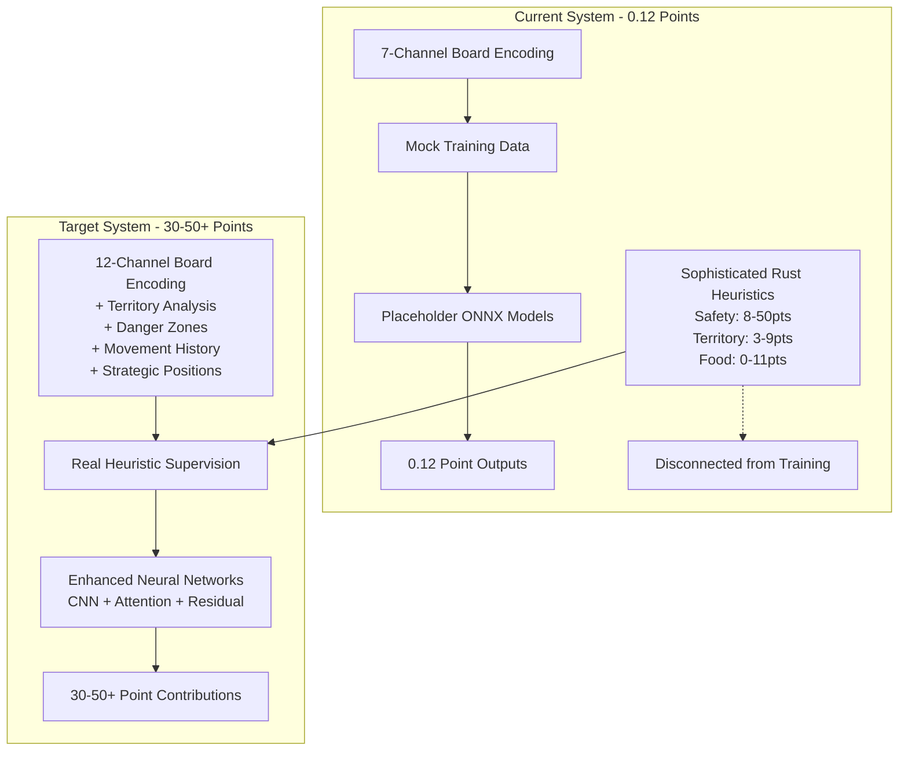
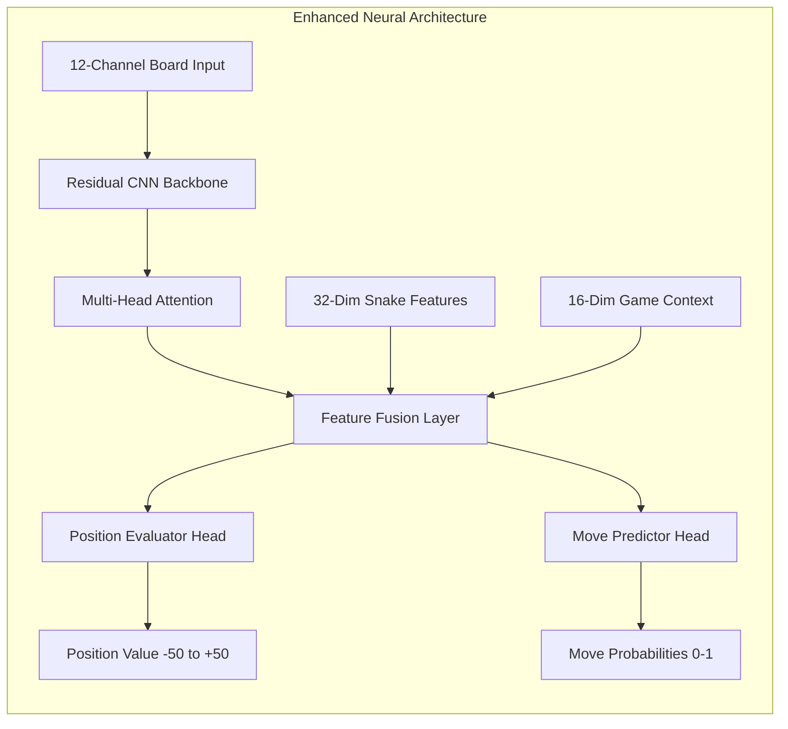

# Neural Network Enhancement Implementation Plan

## Executive Summary

**Problem**: Neural networks contribute only 0.12 placeholder points instead of 30-50+ meaningful points because they're trained on mock data instead of learning from sophisticated Rust heuristics (Safety: 8-50pts, Territory: 3-9pts, Food: 0-11pts).

**Solution**: Implement 12-channel board encoding + heuristic supervision pipeline simultaneously to bridge the gap between sophisticated Rust evaluation and neural network training.

## Current vs Target Architecture

## Implementation Phases

### Phase 1: Foundation Enhancement (Parallel Implementation)

#### Task A: 12-Channel Board Encoding System
**Current**: 7 channels (EMPTY, OWN_HEAD, OWN_BODY, OPPONENT_HEAD, OPPONENT_BODY, FOOD, WALL)
**Target**: 12 channels with advanced spatial analysis

**Missing Channels to Implement:**
- **Channel 6**: Our Territory (Voronoi control analysis)
- **Channel 7**: Opponent Territory (competitive space mapping)  
- **Channel 8**: Danger Zones (collision risk prediction)
- **Channel 9**: Movement History (recent position patterns)
- **Channel 10**: Strategic Positions (cutting points, tactical advantages)

**Technical Specifications:**
- Input: 12-channel (11,11,12) board tensor
- Additional: 32-dim snake features + 16-dim game context
- Integration: Compatible with existing PyTorch architecture
- Performance: <2ms encoding time per board state

#### Task B: Heuristic Supervision Pipeline
**Goal**: Connect Python training system to Rust evaluation functions
**Bridge**: Extract real scores (Safety: 8-50pts, Territory: 3-9pts, Food: 0-11pts)

**Implementation Components:**
- Rust FFI interface for heuristic extraction
- Python data collection bridge
- Real-time evaluation score capture
- Training target generation from sophisticated heuristics

### Phase 2: Neural Architecture Enhancement

**Position Evaluator Network:**
- **Architecture**: CNN + Multi-head Attention + Residual blocks
- **Input**: 12-channel board + snake features + game context
- **Output**: Position value (-50 to +50 points) replacing 0.12 placeholder
- **Target Performance**: <5ms inference, meaningful strategic evaluation

**Move Predictor Network:**
- **Architecture**: Shared CNN backbone + policy head
- **Output**: 4D probability distribution (up/down/left/right)
- **Integration**: Compatible with confidence system for probability-based decisions

### Phase 3: Training and Deployment

**Bootstrap Training System:**
- **Data Source**: Real heuristic supervision from Rust system
- **Training Method**: Multi-task learning (position + move prediction)
- **Loss Functions**: MSE for positions, cross-entropy for moves
- **Validation**: 80/20 split with early stopping
- **Data Augmentation**: Board rotations, mirroring

**ONNX Export and Validation:**
- **Model Files**: position_evaluation.onnx, move_prediction.onnx
- **Size Constraint**: <50MB total for all models
- **Validation**: Verify ONNX outputs match PyTorch predictions
- **Performance**: <10ms total inference time

## Success Metrics

### Performance Targets
- **Position Evaluator**: Output 30-50+ point evaluations (vs 0.12 placeholder)
- **Move Predictor**: >70% agreement with sophisticated heuristic decisions
- **Inference Speed**: <10ms total for both models
- **Memory Usage**: <50MB total model size
- **Training Time**: <2 hours bootstrap training on collected data

### Integration Requirements
- **Compatibility**: Maintain existing ONNX interface with Rust system
- **Confidence System**: Work with Phase 6 confidence system
- **Error Handling**: Graceful fallback when models fail
- **Monitoring**: Training metrics and model performance tracking

## Implementation Strategy

### Critical Path
1. **Weeks 1-2**: Implement 12-channel encoding + heuristic supervision pipeline
2. **Week 3**: Enhanced neural architectures with advanced pattern recognition
3. **Week 4**: Bootstrap training system + ONNX export/validation
4. **Week 5**: Comprehensive testing + end-to-end integration validation

### Risk Mitigation
- **Data Quality**: Validate heuristic extraction accuracy before training
- **Model Complexity**: Start with simpler architectures, add complexity gradually
- **Integration**: Test ONNX compatibility early and frequently
- **Performance**: Benchmark inference speed at each development stage

## Technical Dependencies

### Python Requirements
- PyTorch 2.0+ for neural network implementation
- ONNX 1.12+ for model export
- NumPy for efficient tensor operations
- Pandas for data handling

### Rust Integration
- Existing ONNX inference engine (src/neural_network.rs)
- Hybrid intelligence system (src/neural_network_integration.rs)
- Confidence system integration points

### Hardware Specifications
- **Training**: GPU recommended for efficient training (8GB+ VRAM)
- **Inference**: CPU-optimized ONNX models for production deployment
- **Memory**: <50MB total model footprint for resource-constrained environments

## Expected Outcomes

**Immediate Impact**: Neural networks contributing 30-50+ points instead of 0.12 placeholder
**Strategic Advantage**: AI learning from sophisticated heuristics while adding pattern recognition capabilities
**Scalability**: Foundation for advanced self-play training in future phases
**Production Ready**: Robust, monitored, and validated neural network system

This plan addresses the root cause of placeholder performance by connecting the sophisticated Rust heuristic system to neural network training, enhanced with 12-channel spatial intelligence for pattern recognition that surpasses traditional rule-based approaches.