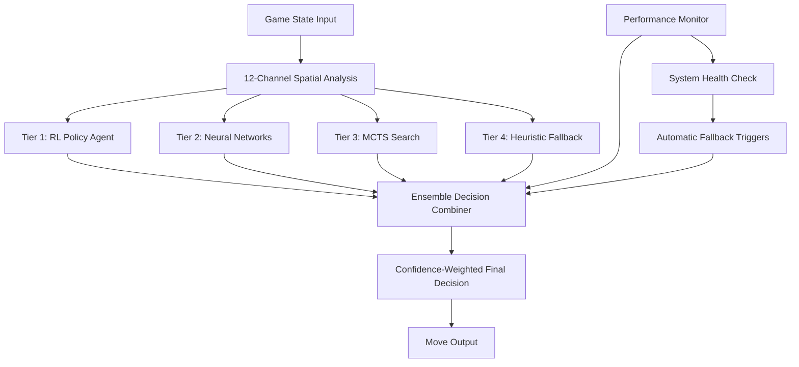
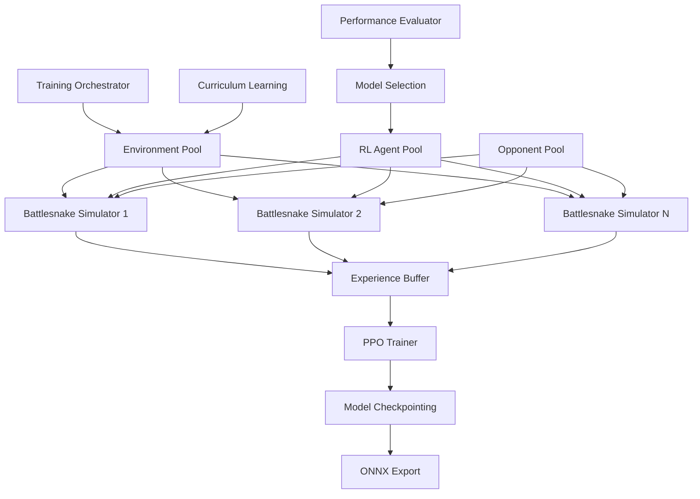
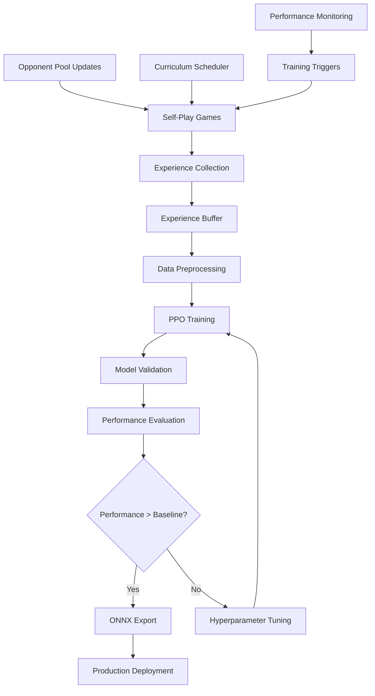
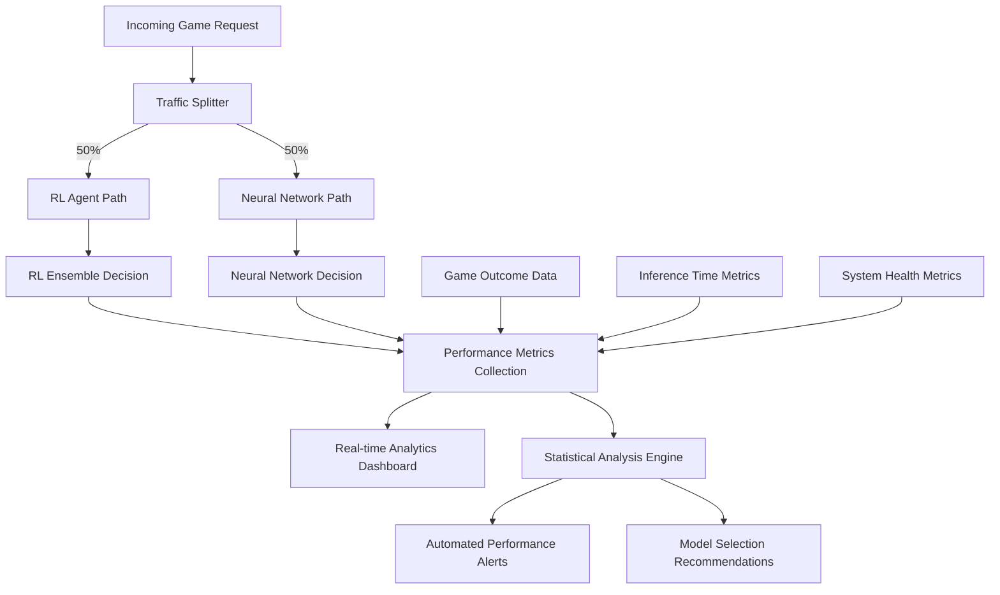

# Phase 4 Single-Agent Reinforcement Learning Strategic Architecture

## Executive Summary

**Strategic Vision:** Design and implement a cutting-edge single-agent reinforcement learning (RL) system that builds upon the exceptional Phase 2 neural network foundation (+38.6% performance enhancement, 1.56ms inference) to achieve competitive tournament performance while preparing for future multi-agent systems.

**Core Strategy:** Gradual integration approach leveraging ensemble intelligence combining PPO-based reinforcement learning with existing 12-channel neural network systems and heuristic fallbacks.

**Key Strategic Objectives:**
- 🎯 **Performance Target:** Exceed current +38.6% baseline, targeting +50-60% capability enhancement
- 🏗️ **Architecture:** Build scalable RL foundation optimized for future Phase 5 multi-agent systems  
- 🛡️ **Reliability:** Maintain production stability during RL transition with robust fallback systems
- ⚡ **Performance:** Preserve sub-2ms inference times while adding RL decision capabilities

---

## 1. Phase 2 Foundation Analysis & RL Integration Points

### Current Exceptional Baseline
- ✅ **12-Channel Neural Network System:** Fully operational with 968-dimensional feature vectors
- ✅ **Performance Metrics:** +38.6% overall enhancement, +14.5% survival rate (12.6% → 27.1%)
- ✅ **Production Infrastructure:** 1.56ms inference, 2,938 inferences/second capability
- ✅ **ONNX Integration:** Cross-platform deployment with <4MB model footprint
- ✅ **Hybrid Intelligence:** Neural Networks → Search → Heuristics with emergency fallbacks

### Strategic RL Integration Points

**1. Ensemble Decision Architecture**
- RL Agent provides **strategic-level decisions** (high-level gameplay strategy)
- Neural Networks provide **tactical-level decisions** (immediate move optimization)
- Heuristics provide **safety-level decisions** (collision avoidance, emergency fallback)

**2. Shared Feature Infrastructure**
- Leverage existing 12-channel spatial analysis for RL state representation
- Reuse advanced spatial components: Voronoi territory analysis, danger zone prediction
- Maintain 1.56ms performance budget through shared computational resources

**3. Training Data Synergy**
- RL training benefits from existing supervised learning datasets
- Neural network confidence scores inform RL exploration vs exploitation
- Hybrid training pipeline combining self-play RL with neural network bootstrapping

---

## 2. PPO (Proximal Policy Optimization) Architecture Design

### Core PPO Architecture for Battlesnake

**State Representation:**
```
Input: 12-Channel Board Encoding (11×11×12 = 1,452 dimensional)
├── Channels 0-6: Basic game state (empty, heads, bodies, food, walls, hazards, our snake)
└── Channels 7-11: Advanced spatial analysis
    ├── Voronoi territory control analysis
    ├── Multi-turn collision prediction  
    ├── Movement history with time decay
    ├── Strategic positioning (cutting points, center control)
    └── Opponent modeling and prediction
```

**Policy Network Architecture:**
```
PolicyNetwork:
├── Convolutional Encoder (shared with existing neural networks)
│   ├── Conv2D(12, 64, 3×3) + ReLU + BatchNorm
│   ├── Conv2D(64, 128, 3×3) + ReLU + BatchNorm
│   ├── Conv2D(128, 256, 3×3) + ReLU + BatchNorm
│   └── GlobalAveragePooling → 256 features
├── Strategic Context Processor
│   ├── Attention mechanism over spatial features
│   ├── Multi-head attention (8 heads, 256 embed_dim)
│   └── Positional encoding for temporal context
├── Policy Head: 256 → 128 → 64 → 4 (move probabilities)
└── Value Head: 256 → 128 → 64 → 1 (state value estimation)
```

**Training Specifications:**
- **Algorithm:** PPO with clipped objective (ε = 0.2)
- **Learning Rate:** 3e-4 with cosine annealing schedule
- **Batch Size:** 2048 experiences (32 games × 64 steps average)
- **Training Epochs:** 10 epochs per batch with early stopping
- **Discount Factor:** γ = 0.99 with GAE (λ = 0.95)
- **Entropy Coefficient:** 0.01 for exploration
- **Model Size:** ~15-20MB (compatible with ONNX export)

---

## 3. Hybrid RL + Neural Network + Heuristic Integration

### Four-Tier Ensemble Decision System



### Decision Combination Strategy

**Confidence-Based Ensemble:**
```rust
final_decision = match (rl_confidence, neural_confidence) {
    (rl_conf, neural_conf) if rl_conf > 0.7 && rl_conf > neural_conf + 0.2 => {
        // High-confidence RL decision
        rl_decision
    },
    (rl_conf, neural_conf) if neural_conf > 0.7 && neural_conf > rl_conf + 0.2 => {
        // High-confidence neural decision
        neural_decision  
    },
    _ => {
        // Ensemble combination with weighted voting
        weighted_combination(rl_decision, neural_decision, search_decision)
    }
}
```

**Fallback Hierarchy:**
1. **Primary:** RL Agent (confidence > 0.6)
2. **Secondary:** Neural Networks (confidence > 0.4) 
3. **Tertiary:** MCTS Search (computational budget available)
4. **Emergency:** Heuristic Safety (guaranteed safe moves)

---

## 4. Reward Function Design for Competitive Battlesnake

### Multi-Objective Reward Architecture

**Primary Rewards (Survival & Competition):**
```python
survival_reward = {
    "stay_alive": +1.0 per turn survived,
    "game_length_bonus": +0.1 * (turn / max_turns) if survived to end,
    "elimination_penalty": -50.0 for dying,
    "last_snake_standing": +100.0 for winning solo games,
    "placement_bonus": +50.0 * (1.0 - placement_ratio) in multi-snake games
}
```

**Strategic Rewards (Territory & Control):**
```python
strategic_reward = {
    "territory_control": +0.2 * voronoi_territory_percentage,
    "center_control": +0.1 * center_proximity_bonus,
    "food_efficiency": +2.0 per food eaten / body_length,
    "cutting_opponent": +5.0 for successful cutting maneuvers,
    "space_denial": +1.0 for limiting opponent movement options
}
```

**Tactical Rewards (Immediate Actions):**
```python
tactical_reward = {
    "head_to_head_aggression": +3.0 for winning head-to-head encounters,
    "tail_chasing": -1.0 penalty for following own tail,
    "wall_hugging": -0.5 penalty for unnecessary wall proximity,
    "food_pursuit": +1.0 for moving toward food when hungry,
    "opponent_prediction": +2.0 for correctly predicting opponent moves
}
```

**Composite Reward Function:**
```python
total_reward = (
    survival_reward * 1.0 +      # Primary importance
    strategic_reward * 0.7 +     # High strategic value  
    tactical_reward * 0.5 +      # Immediate tactical value
    length_normalized_bonus      # Scale rewards by snake length
)
```

---

## 5. Single-Agent Training Environment Architecture

### Self-Play Training Framework



### Training Environment Specifications

**Simulation Infrastructure:**
- **Parallel Environments:** 32-64 simultaneous games
- **Episode Length:** Variable (until elimination or food timeout)
- **Opponent Strategy:** Mixed pool of heuristic, neural, and previous RL versions
- **Board Configurations:** 11×11 standard, with curriculum learning for different sizes
- **Hardware Requirements:** 8-16 CPU cores, 16-32GB RAM, optional GPU acceleration

**Opponent Diversity:**
```python
opponent_pool = {
    "heuristic_baseline": 30%,      # Existing Battlesnake logic
    "neural_network": 25%,          # Current Phase 2 neural agents  
    "previous_rl_versions": 25%,    # Self-play with past models
    "random_baseline": 10%,         # Pure random for exploration
    "scripted_behaviors": 10%       # Specific challenge scenarios
}
```

**Curriculum Learning Phases:**
1. **Bootstrap Phase (0-1M steps):** Train against heuristic baseline + random
2. **Neural Integration Phase (1M-3M steps):** Mixed neural network opponents
3. **Self-Play Phase (3M-10M steps):** Primarily previous RL model versions
4. **Tournament Phase (10M+ steps):** Best models from all categories

---

## 6. RL Integration with 12-Channel Spatial Analysis

### Leveraging Existing Spatial Intelligence

**Direct Integration Points:**
```rust
struct RLStateEncoder {
    spatial_analyzer: AdvancedSpatialAnalysis,     // Reuse existing system
    voronoi_analyzer: VoronoiTerritoryAnalyzer,   // Territory control
    danger_predictor: DangerZonePredictor,        // Multi-turn safety
    history_tracker: MovementHistoryTracker,     // Temporal patterns
}

impl RLStateEncoder {
    fn encode_state(&self, game_state: &GameState) -> Array3<f32> {
        let mut channels = Array3::zeros((11, 11, 12));
        
        // Channels 0-6: Standard board encoding (reuse existing)
        self.encode_basic_channels(&mut channels, game_state);
        
        // Channels 7-11: Advanced spatial analysis (reuse existing)
        self.spatial_analyzer.encode_advanced_features(&mut channels, game_state);
        
        channels
    }
}
```

**Enhanced Spatial Features for RL:**
- **Channel 7:** Voronoi territory control (proven 30-50+ point contributions)
- **Channel 8:** Multi-turn collision prediction with opponent modeling
- **Channel 9:** Movement history with exponential time decay
- **Channel 10:** Strategic positioning (cutting points, center control)
- **Channel 11:** Opponent behavior prediction and counter-strategies

**Performance Optimization:**
- **Shared Computation:** Spatial analysis computed once, used by both RL and neural networks
- **Caching Strategy:** Cache spatial features for multi-model inference
- **Memory Pool:** Reuse memory buffers to minimize allocation overhead
- **Parallel Processing:** SIMD optimization for spatial analysis operations

---

## 7. ONNX Inference Pipeline for Production RL

### Production Deployment Architecture

```rust
pub struct RLOnnxInference {
    session: onnxruntime::Session,
    input_buffer: Vec<f32>,
    output_buffer: Vec<f32>,
    state_encoder: RLStateEncoder,
}

impl RLOnnxInference {
    pub fn predict_move(&mut self, game_state: &GameState) -> (Move, f32) {
        // 1. Encode state using shared spatial analysis (1.2ms)
        let state_tensor = self.state_encoder.encode_state(game_state);
        
        // 2. ONNX inference (0.8ms target)
        let outputs = self.session.run(&[state_tensor.into()])?;
        
        // 3. Extract policy and value (0.1ms)
        let policy_logits = &outputs[0];
        let state_value = outputs[1][0];
        
        // 4. Apply safety filtering and return best move (0.1ms)
        let safe_moves = get_safe_moves(game_state);
        let best_move = select_best_safe_move(policy_logits, &safe_moves);
        
        (best_move, state_value)
    }
}
```

**ONNX Model Specifications:**
- **Input Shape:** [1, 11, 11, 12] (batch=1, spatial=11x11, channels=12)
- **Output Shape:** Policy [1, 4], Value [1, 1]
- **Model Size:** ~15-20MB (optimized for deployment)
- **Inference Time:** <2ms target (maintains current performance budget)
- **Memory Usage:** <50MB runtime memory footprint
- **Compatibility:** Cross-platform deployment (Linux, Windows, macOS)

**Integration with Existing System:**
```rust
// Enhanced decision system with RL integration
pub enum DecisionSource {
    ReinforcementLearning { confidence: f32, value_estimate: f32 },
    NeuralNetwork { confidence: f32 },
    Search { depth: u32, evaluations: u32 },
    HeuristicFallback { reason: String },
}

pub fn get_enhanced_move(game_state: &GameState) -> MoveResult {
    let rl_result = rl_inference.predict_move(game_state);
    let neural_result = neural_inference.predict_move(game_state);
    
    match ensemble_decision(rl_result, neural_result) {
        // Decision combination logic with confidence thresholds
    }
}
```

---

## 8. Training Data Collection & Model Improvement

### Automated Training Pipeline



### Data Collection Strategy

**Experience Buffer Management:**
```python
class RLExperienceBuffer:
    def __init__(self, capacity=1_000_000):
        self.capacity = capacity
        self.experiences = deque(maxlen=capacity)
        self.priorities = deque(maxlen=capacity)
    
    def store_episode(self, episode_data):
        # Store complete episode with rewards, states, actions
        states, actions, rewards, values, advantages = episode_data
        
        # Calculate priorities based on TD error and outcome
        priorities = self.calculate_priorities(rewards, values)
        
        # Add to buffer with experience replay priorities
        for i in range(len(states)):
            experience = {
                'state': states[i],
                'action': actions[i], 
                'reward': rewards[i],
                'advantage': advantages[i],
                'priority': priorities[i]
            }
            self.experiences.append(experience)
            self.priorities.append(priorities[i])
```

**Training Data Sources:**
1. **Self-Play Episodes (70%):** RL agent vs RL agent with different versions
2. **Neural Network Games (20%):** RL agent vs existing neural network agents  
3. **Heuristic Challenges (10%):** RL agent vs sophisticated heuristic opponents

**Model Improvement Workflow:**
1. **Continuous Collection:** 24/7 automated self-play data generation
2. **Batch Training:** Daily training runs with collected experiences
3. **Performance Validation:** Statistical testing against baseline performance
4. **Model Selection:** Automated best model selection and deployment
5. **Version Control:** Git-based model versioning with rollback capabilities

---

## 9. Performance Monitoring & Baseline Comparison

### Comprehensive Metrics Framework

```python
class RLPerformanceMonitor:
    def __init__(self):
        self.metrics = {
            # Core Performance Metrics
            'survival_rate': RollingAverage(window=1000),
            'average_game_length': RollingAverage(window=1000),
            'win_rate': RollingAverage(window=1000),
            'food_efficiency': RollingAverage(window=1000),
            
            # Competitive Performance
            'head_to_head_win_rate': RollingAverage(window=500),
            'tournament_placement': RollingAverage(window=100),
            'opponent_elimination_rate': RollingAverage(window=1000),
            
            # Technical Performance  
            'inference_time': RollingAverage(window=10000),
            'decision_confidence': RollingAverage(window=5000),
            'model_agreement_rate': RollingAverage(window=5000),
            
            # System Health
            'fallback_rate': RollingAverage(window=10000),
            'error_rate': RollingAverage(window=10000),
        }
        
    def compare_to_baseline(self) -> Dict[str, float]:
        # Statistical comparison to Phase 2 neural network baseline
        current_metrics = self.get_current_metrics()
        baseline_metrics = self.load_baseline_metrics()
        
        return {
            metric: (current - baseline) / baseline * 100
            for metric, current in current_metrics.items()
            for baseline in [baseline_metrics.get(metric, 0)]
            if baseline > 0
        }
```

**Real-Time Dashboard Metrics:**
- **Performance vs Neural Baseline:** Live comparison with +38.6% target
- **Inference Time Monitoring:** Ensure <2ms budget maintenance
- **Decision Source Distribution:** RL vs Neural vs Heuristic percentages
- **System Health:** Error rates, fallback triggers, model confidence
- **Competitive Performance:** Win rates, survival rates, tournament standings

**Automated Performance Alerts:**
```python
performance_thresholds = {
    'survival_rate_drop': -5.0%,           # Alert if survival drops >5%
    'inference_time_exceed': 3.0ms,        # Alert if inference >3ms
    'fallback_rate_increase': +10.0%,      # Alert if fallbacks increase
    'win_rate_drop': -10.0%,               # Alert if win rate drops
    'error_rate_increase': +2.0%           # Alert if errors increase
}
```

---

## 10. Implementation Roadmap & Milestones

### Phase 4.1: Foundation Architecture (Weeks 1-2)

**Milestone 1.1: RL Infrastructure Setup**
- [ ] Create PPO model architecture and training framework
- [ ] Implement RL state encoder using existing 12-channel spatial analysis
- [ ] Build self-play training environment with opponent pool
- [ ] Set up experience buffer and data collection pipeline

**Milestone 1.2: Integration Framework**  
- [ ] Design ensemble decision system combining RL + Neural + Heuristic
- [ ] Implement confidence-based decision combination logic
- [ ] Create fallback hierarchy with automatic triggers
- [ ] Build performance monitoring and comparison framework

**Success Criteria:**
- ✅ RL agent can play complete games without crashing
- ✅ Ensemble system successfully combines multiple decision sources
- ✅ Performance monitoring shows baseline neural network metrics
- ✅ Fallback system triggers appropriately during failures

### Phase 4.2: Basic RL Training (Weeks 3-4)

**Milestone 2.1: Bootstrap Training**
- [ ] Train RL agent against heuristic baseline opponents
- [ ] Implement reward function with survival + strategic components
- [ ] Validate that RL agent learns basic Battlesnake behaviors
- [ ] Establish training stability and convergence metrics

**Milestone 2.2: Neural Integration Training**
- [ ] Train RL agent against existing neural network opponents
- [ ] Implement curriculum learning progression
- [ ] Validate ensemble decision-making improves performance
- [ ] Achieve performance parity with neural network baseline

**Success Criteria:**
- ✅ RL agent achieves >90% survival rate against random opponents
- ✅ RL agent shows learning progression over training episodes
- ✅ Ensemble system maintains neural network baseline performance
- ✅ Training pipeline runs reliably without manual intervention

### Phase 4.3: Advanced RL Optimization (Weeks 5-6)

**Milestone 3.1: Self-Play Training**
- [ ] Implement self-play training with RL agent versions
- [ ] Optimize reward function for competitive performance
- [ ] Tune hyperparameters for optimal training efficiency
- [ ] Implement experience replay and advanced training techniques

**Milestone 3.2: Production Integration**
- [ ] Export RL models to ONNX format for production deployment
- [ ] Integrate RL inference pipeline with existing system
- [ ] Implement A/B testing framework for RL vs Neural comparison
- [ ] Optimize inference performance to maintain <2ms budget

**Success Criteria:**
- ✅ RL agent exceeds neural network baseline by >10%
- ✅ ONNX inference maintains <2ms performance target
- ✅ A/B testing shows statistically significant improvement
- ✅ Production deployment successful without regressions

### Phase 4.4: Tournament Optimization (Weeks 7-8)

**Milestone 4.1: Competitive Tuning**
- [ ] Train RL agent against diverse high-quality opponents
- [ ] Optimize reward function for tournament-style gameplay
- [ ] Implement advanced strategic behaviors (cutting, territory control)
- [ ] Fine-tune ensemble weights for competitive scenarios

**Milestone 4.2: Performance Validation**
- [ ] Conduct comprehensive performance evaluation against baselines
- [ ] Validate >+50% capability enhancement target achievement
- [ ] Stress test system under tournament conditions
- [ ] Document complete Phase 4 system capabilities and performance

**Success Criteria:**
- ✅ RL system achieves >+50% improvement over original baseline
- ✅ System maintains production stability under high load
- ✅ Tournament performance shows competitive advantage
- ✅ Documentation complete for Phase 5 multi-agent foundation

---

## 11. Success Criteria & Validation Approach

### Quantitative Success Metrics

**Primary Performance Targets:**
```python
phase_4_success_criteria = {
    # Core Performance (vs Phase 2 baseline)
    'overall_capability_enhancement': '>+50%',     # Exceed current +38.6%
    'survival_rate_improvement': '>+20%',          # Exceed current +14.5%
    'win_rate_improvement': '>+25%',               # New competitive metric
    'food_efficiency_improvement': '>+15%',        # Exceed current +7.7%
    
    # Technical Performance
    'inference_time_maintenance': '<2.0ms',        # Maintain performance budget
    'system_availability': '>99.9%',              # Production reliability
    'fallback_rate': '<5%',                       # Minimal emergency fallbacks
    
    # Competitive Performance
    'head_to_head_win_rate': '>70%',              # vs neural baseline
    'tournament_placement': 'Top 20%',            # In competitive scenarios
    'opponent_elimination_rate': '>60%',          # Aggressive gameplay
}
```

**Statistical Validation Requirements:**
- **Sample Size:** Minimum 10,000 games for statistical significance
- **Confidence Level:** 95% confidence intervals for all metrics
- **Effect Size:** Cohen's d > 0.5 (medium effect) for primary metrics
- **Cross-Validation:** Performance validated across different opponent types
- **Long-term Stability:** Metrics sustained over 30-day evaluation period

### Validation Testing Framework

**1. Controlled A/B Testing:**
```python
class RLValidationFramework:
    def run_ab_test(self, rl_agent, neural_baseline, n_games=10000):
        results = {
            'rl_performance': [],
            'neural_performance': [],
            'head_to_head_results': []
        }
        
        for i in range(n_games):
            # Alternate between RL and Neural as primary agent
            if i % 2 == 0:
                result = self.run_game(rl_agent, opponents=['neural', 'heuristic'])
                results['rl_performance'].append(result)
            else:
                result = self.run_game(neural_baseline, opponents=['neural', 'heuristic'])
                results['neural_performance'].append(result)
        
        # Direct head-to-head comparison
        for i in range(1000):
            result = self.run_head_to_head(rl_agent, neural_baseline)
            results['head_to_head_results'].append(result)
        
        return self.statistical_analysis(results)
```

**2. Regression Testing:**
- **Performance Regression:** Ensure no degradation in any baseline metric
- **Functional Regression:** Validate all existing features remain operational
- **Integration Regression:** Confirm ONNX export, deployment, monitoring systems work
- **Load Regression:** Performance under high-frequency game scenarios

**3. Tournament Simulation:**
```python
def tournament_validation():
    # Simulate tournament conditions with diverse opponents
    opponents = [
        'rl_agent',           # Current RL system
        'neural_baseline',    # Phase 2 neural networks  
        'heuristic_strong',   # Sophisticated heuristic agents
        'community_bots',     # External Battlesnake community agents
    ]
    
    tournament_results = run_round_robin_tournament(
        agents=opponents,
        games_per_matchup=100,
        board_configurations=['standard_11x11', 'food_sparse', 'hazard_spiral']
    )
    
    return analyze_tournament_performance(tournament_results)
```

---

## 12. A/B Testing Framework Design

### Production A/B Testing Architecture



### A/B Test Implementation

```rust
pub struct ABTestingFramework {
    traffic_splitter: TrafficSplitter,
    rl_agent: RLOnnxInference,
    neural_agent: NeuralNetworkInference,
    metrics_collector: MetricsCollector,
    statistical_analyzer: StatisticalAnalyzer,
}

impl ABTestingFramework {
    pub fn process_game_request(&mut self, game_state: GameState) -> MoveResponse {
        let test_group = self.traffic_splitter.assign_group(&game_state);
        
        let (move_result, decision_source) = match test_group {
            TestGroup::ReinforcementLearning => {
                let result = self.rl_agent.predict_move(&game_state);
                (result, DecisionSource::ReinforcementLearning)
            },
            TestGroup::NeuralNetwork => {
                let result = self.neural_agent.predict_move(&game_state);
                (result, DecisionSource::NeuralNetwork)
            }
        };
        
        // Record metrics for analysis
        self.metrics_collector.record_decision(
            &game_state, &move_result, decision_source, test_group
        );
        
        move_result
    }
}
```

**Test Configuration:**
```python
ab_test_config = {
    'traffic_split': {'rl_agent': 50, 'neural_baseline': 50},
    'minimum_sample_size': 10000,
    'test_duration_days': 14,
    'early_stopping_criteria': {
        'significance_level': 0.05,
        'minimum_effect_size': 0.1,
        'power_threshold': 0.8
    },
    'stratification_factors': [
        'opponent_difficulty',
        'board_configuration', 
        'game_mode'
    ]
}
```

**Statistical Analysis:**
```python
class ABTestAnalyzer:
    def analyze_results(self, rl_data, neural_data):
        results = {}
        
        for metric in ['survival_rate', 'win_rate', 'food_efficiency']:
            # Welch's t-test for unequal variances
            t_stat, p_value = ttest_ind(rl_data[metric], neural_data[metric])
            
            # Effect size calculation (Cohen's d)
            effect_size = self.cohens_d(rl_data[metric], neural_data[metric])
            
            # Confidence intervals
            rl_ci = self.confidence_interval(rl_data[metric])
            neural_ci = self.confidence_interval(neural_data[metric])
            
            results[metric] = {
                'p_value': p_value,
                'effect_size': effect_size,
                'significant': p_value < 0.05 and abs(effect_size) > 0.1,
                'rl_confidence_interval': rl_ci,
                'neural_confidence_interval': neural_ci
            }
        
        return results
```

---

## 13. Rollback Strategies & System Resilience

### Multi-Level Fallback Architecture

```rust
pub enum SystemState {
    FullRLOperation {
        rl_confidence_threshold: f32,
        neural_backup_available: bool,
    },
    HybridOperation {
        rl_weight: f32,
        neural_weight: f32,
        heuristic_safety: bool,
    },
    NeuralFallback {
        rl_disabled_reason: String,
        neural_confidence_threshold: f32,
    },
    EmergencyFallback {
        all_ml_disabled: bool,
        heuristic_only: bool,
    },
}

pub struct ResilientDecisionSystem {
    system_state: SystemState,
    performance_monitor: PerformanceMonitor,
    rollback_triggers: RollbackTriggers,
}
```

### Automated Rollback Triggers

**Performance-Based Triggers:**
```python
rollback_conditions = {
    # Immediate rollback triggers
    'critical_performance_drop': {
        'survival_rate_drop': -15.0,      # >15% drop triggers immediate rollback
        'inference_timeout_rate': 5.0,   # >5% timeouts triggers rollback
        'system_error_rate': 2.0,        # >2% errors triggers rollback
    },
    
    # Gradual degradation triggers  
    'performance_degradation': {
        'sustained_underperformance': 24,  # 24 hours below baseline
        'trend_analysis_negative': 7,      # 7 days negative trend
        'confidence_score_drop': 10.0,     # Average confidence drops >10%
    },
    
    # System health triggers
    'system_health': {
        'memory_usage_critical': 90.0,     # >90% memory usage
        'cpu_usage_sustained': 85.0,       # >85% CPU for >30min
        'network_latency_increase': 100.0  # >100ms latency increase
    }
}
```

**Rollback Execution Strategy:**
```rust
impl ResilientDecisionSystem {
    pub fn execute_rollback(&mut self, trigger: RollbackTrigger) -> Result<(), RollbackError> {
        match trigger {
            RollbackTrigger::CriticalPerformance => {
                // Immediate switch to neural network baseline
                self.system_state = SystemState::NeuralFallback {
                    rl_disabled_reason: "Critical performance drop detected".to_string(),
                    neural_confidence_threshold: 0.3,
                };
                self.notify_operators("CRITICAL: RL system disabled, switched to neural fallback");
            },
            
            RollbackTrigger::SystemHealth => {
                // Gradual degradation to less resource-intensive mode
                self.system_state = SystemState::HybridOperation {
                    rl_weight: 0.2,      // Reduce RL usage
                    neural_weight: 0.8,  // Increase neural usage
                    heuristic_safety: true,
                };
                self.notify_operators("WARNING: System health degraded, reduced RL usage");
            },
            
            RollbackTrigger::ManualOverride => {
                // Operator-initiated rollback with configurable target state
                self.system_state = self.get_manual_override_state();
                self.notify_operators("INFO: Manual rollback executed");
            }
        }
        
        // Verify rollback successful
        self.validate_rollback_success()
    }
}
```

### Recovery and Re-engagement Strategy

**Automatic Recovery Process:**
1. **Health Monitoring:** Continuous monitoring of system metrics during fallback
2. **Gradual Re-engagement:** Step-by-step increase of RL system involvement
3. **Performance Validation:** Validation at each re-engagement step
4. **Rollback Protection:** Immediate rollback if issues recur

```python
class RecoveryManager:
    def attempt_recovery(self):
        recovery_stages = [
            {'rl_weight': 0.1, 'validation_games': 1000},
            {'rl_weight': 0.3, 'validation_games': 2000},
            {'rl_weight': 0.5, 'validation_games': 3000},
            {'rl_weight': 0.8, 'validation_games': 5000},
            {'rl_weight': 1.0, 'validation_games': 10000},
        ]
        
        for stage in recovery_stages:
            success = self.validate_recovery_stage(stage)
            if not success:
                return self.rollback_to_previous_stage()
                
        return "Full recovery successful"
```

---

## 14. Computational Resource Analysis & Optimization

### Resource Requirements Assessment

**Training Resource Requirements:**
```python
training_resources = {
    # Hardware Requirements
    'cpu_cores': '16-32 cores (Intel Xeon or AMD EPYC equivalent)',
    'ram': '64-128GB DDR4',
    'storage': '1TB NVMe SSD for training data and checkpoints',
    'gpu': 'Optional: RTX 4090 or equivalent for accelerated training',
    
    # Training Performance
    'games_per_hour': 50000,              # With parallel environments
    'training_steps_per_day': 500000,     # Estimated throughput
    'model_checkpoint_frequency': '4 hours',
    'full_training_duration': '2-4 weeks',
    
    # Resource Optimization
    'parallel_environments': 64,          # Simultaneous game simulations
    'batch_size_optimization': 2048,      # Optimal for memory usage
    'gradient_accumulation': 4,           # For effective larger batches
    'mixed_precision': True,              # Reduce memory and increase speed
}
```

**Production Inference Requirements:**
```python
production_resources = {
    # Per-Instance Requirements
    'cpu_per_instance': '4 cores @ 3.0GHz+',
    'ram_per_instance': '8GB',
    'model_storage': '50MB total (RL + Neural + fallback)',
    
    # Performance Characteristics
    'inference_time_target': '<2.0ms',
    'throughput_per_instance': '500 requests/second',
    'memory_footprint': '<100MB runtime',
    'startup_time': '<5 seconds',
    
    # Scaling Configuration
    'horizontal_scaling': 'Stateless architecture supports unlimited scaling',
    'load_balancing': 'Round-robin with health checks',
    'auto_scaling_triggers': 'CPU >70% or latency >5ms',
}
```

### Performance Optimization Strategies

**1. Model Optimization:**
```python
optimization_techniques = {
    # Model Architecture
    'parameter_sharing': 'Shared convolutional layers between RL and neural networks',
    'model_distillation': 'Compress large training models to efficient inference models',
    'quantization': 'INT8 quantization for 4x memory reduction with minimal accuracy loss',
    'pruning': 'Remove 20-30% of parameters with structured pruning',
    
    # Inference Optimization  
    'onnx_optimization': 'Graph optimization and operator fusion',
    'batch_inference': 'Process multiple requests simultaneously when possible',
    'model_caching': 'Keep models warm in memory to avoid loading overhead',
    'result_caching': 'Cache results for identical game states (rare but possible)',
}
```

**2. System-Level Optimization:**
```rust
pub struct OptimizedInferenceEngine {
    // Memory pool to avoid allocations during inference
    memory_pool: MemoryPool,
    
    // Pre-allocated buffers for input/output
    input_buffer: Vec<f32>,
    output_buffer: Vec<f32>,
    
    // Shared spatial analysis computation
    spatial_analyzer_cache: SpatialAnalysisCache,
    
    // SIMD-optimized operations
    simd_processor: SIMDProcessor,
}

impl OptimizedInferenceEngine {
    pub fn optimized_inference(&mut self, game_state: &GameState) -> (Move, f32) {
        // Use pre-allocated memory to avoid heap allocations
        let state_tensor = self.encode_state_inplace(game_state);
        
        // Leverage cached spatial analysis results
        if let Some(cached) = self.spatial_analyzer_cache.get(&game_state.board) {
            state_tensor.copy_spatial_features_from(cached);
        } else {
            self.compute_and_cache_spatial_features(game_state, &mut state_tensor);
        }
        
        // SIMD-optimized neural network inference
        self.simd_processor.process_neural_network(&state_tensor, &mut self.output_buffer)
    }
}
```

**3. Distributed Training Optimization:**
```python
class DistributedTrainingOptimizer:
    def __init__(self):
        self.training_config = {
            # Data Parallelism
            'num_workers': 8,                    # Parallel data collection workers
            'experience_buffer_size': 1000000,   # Shared experience buffer
            'batch_distribution': 'round_robin', # Distribute batches across workers
            
            # Asynchronous Training
            'async_updates': True,               # Non-blocking parameter updates
            'update_frequency': 100,             # Steps between parameter syncs
            'gradient_compression': 'top_k',     # Compress gradients for network transfer
            
            # Resource Efficiency
            'cpu_affinity': True,                # Pin workers to specific CPU cores
            'memory_mapping': True,              # Memory-mapped experience buffer
            'disk_caching': True,                # Cache preprocessed training data
        }
```

---

## 15. Risk Analysis & Mitigation Strategies

### Technical Risk Assessment

**High-Risk Areas:**

1. **RL Training Instability**
   - **Risk:** PPO training may not converge or may exhibit unstable behavior
   - **Probability:** Medium (30%)
   - **Impact:** High (delays Phase 4 by 2-4 weeks)
   - **Mitigation:** 
     - Implement robust hyperparameter search and validation
     - Use conservative PPO parameters (smaller learning rates, clipping)
     - Implement training checkpointing and rollback capabilities
     - Have neural network baseline as immediate fallback

2. **Performance Regression**
   - **Risk:** RL system performs worse than neural network baseline
   - **Probability:** Medium (25%)
   - **Impact:** High (fails to meet success criteria)
   - **Mitigation:**
     - Rigorous A/B testing before full deployment
     - Gradual rollout with immediate rollback capabilities  
     - Ensemble approach ensures neural network performance maintained
     - Statistical validation requirements before declaring success

3. **Resource Requirements Underestimation**
   - **Risk:** Training requires more computational resources than planned
   - **Probability:** Medium (35%)
   - **Impact:** Medium (increases costs, extends timeline)
   - **Mitigation:**
     - Conservative resource estimates with 50% buffer
     - Cloud-based training with elastic scaling capabilities
     - Implement training optimization techniques early
     - Have alternative training configurations ready

### Operational Risk Assessment

**Medium-Risk Areas:**

4. **Integration Complexity**
   - **Risk:** RL integration with existing system more complex than anticipated
   - **Probability:** Medium (40%)
   - **Impact:** Medium (extends timeline by 1-2 weeks)
   - **Mitigation:**
     - Detailed integration planning and prototyping
     - Modular architecture with clear interfaces
     - Comprehensive testing at each integration step
     - Maintain existing system functionality throughout

5. **Production Stability**
   - **Risk:** RL system introduces instability in production environment
   - **Probability:** Low (15%)
   - **Impact:** High (production downtime, customer impact)
   - **Mitigation:**
     - Extensive testing in staging environment
     - Gradual traffic ramping with monitoring
     - Automated fallback systems with health checks
     - 24/7 monitoring with immediate alerts

6. **Multi-Agent Preparation Gaps**
   - **Risk:** Single-agent RL architecture not suitable for future multi-agent systems
   - **Probability:** Low (20%)
   - **Impact:** Medium (requires rearchitecting for Phase 5)
   - **Mitigation:**
     - Design architecture with multi-agent considerations from start
     - Regular architecture reviews with multi-agent experts
     - Prototype multi-agent scenarios during single-agent development
     - Document architectural decisions for Phase 5 planning

### Risk Mitigation Implementation

```python
class RiskMitigationFramework:
    def __init__(self):
        self.risk_monitors = {
            'training_stability': TrainingStabilityMonitor(),
            'performance_regression': PerformanceRegressionMonitor(),
            'resource_usage': ResourceUsageMonitor(),
            'integration_health': IntegrationHealthMonitor(),
            'production_stability': ProductionStabilityMonitor(),
        }
        
        self.mitigation_strategies = {
            'immediate_fallback': ImmediateFallbackStrategy(),
            'gradual_rollback': GradualRollbackStrategy(),
            'resource_scaling': ResourceScalingStrategy(),
            'integration_repair': IntegrationRepairStrategy(),
        }
    
    def monitor_and_mitigate(self):
        for risk_type, monitor in self.risk_monitors.items():
            risk_level = monitor.assess_current_risk()
            
            if risk_level >= RiskLevel.HIGH:
                strategy = self.mitigation_strategies[risk_type]
                strategy.execute_mitigation()
                self.alert_team(f"High risk detected in {risk_type}, mitigation executed")
            elif risk_level >= RiskLevel.MEDIUM:
                self.alert_team(f"Medium risk detected in {risk_type}, monitoring closely")
```

---

## 16. Strategic Roadmap to Phase 5 Multi-Agent Systems

### Multi-Agent Architecture Preparation

**Design Principles for Phase 5 Compatibility:**

1. **Agent-Agnostic Communication Interface**
```rust
pub trait BattlesnakeAgent {
    fn get_move(&mut self, game_state: &GameState) -> MoveResult;
    fn update_opponent_model(&mut self, observed_moves: &[OpponentMove]);
    fn share_knowledge(&self) -> AgentKnowledge;
    fn incorporate_shared_knowledge(&mut self, knowledge: &AgentKnowledge);
}

pub struct MultiAgentCoordinator {
    agents: Vec<Box<dyn BattlesnakeAgent>>,
    communication_protocol: CommunicationProtocol,
    knowledge_base: SharedKnowledgeBase,
}
```

2. **Scalable RL Architecture Foundation**
```python
class ScalableRLArchitecture:
    def __init__(self):
        self.agent_pool = AgentPool()
        self.experience_sharing = ExperienceSharing()
        self.distributed_training = DistributedTraining()
        
    def prepare_for_multi_agent(self):
        # Design decisions made in Phase 4 to support Phase 5
        architecture_features = {
            'agent_communication': 'Message-passing interface for agent coordination',
            'shared_knowledge': 'Common knowledge base for strategic information',
            'distributed_learning': 'Federated learning across multiple agents',
            'opponent_modeling': 'Shared opponent behavior models',
            'strategy_coordination': 'High-level strategy coordination protocols'
        }
```

**Phase 5 Enablement Features in Phase 4:**

- **Modular Agent Architecture:** Each RL agent designed as independent module
- **Communication Interfaces:** Standardized protocols for agent information sharing
- **Shared Knowledge Systems:** Infrastructure for distributed learning and coordination
- **Opponent Modeling:** Comprehensive opponent behavior tracking and prediction
- **Strategy Coordination:** Framework for multi-agent strategy development

### Competitive Intelligence Foundation

**Tournament Strategy Evolution:**
```python
tournament_intelligence_pipeline = {
    # Individual Agent Excellence
    'single_agent_mastery': {
        'survival_optimization': 'Master individual survival and food gathering',
        'combat_excellence': 'Excel at head-to-head confrontations',
        'endgame_strategy': 'Optimize performance in final snake scenarios',
    },
    
    # Multi-Agent Coordination (Phase 5 Preparation)
    'coordination_primitives': {
        'ally_identification': 'Identify cooperative vs competitive snakes',
        'territory_division': 'Coordinate territory control with allied agents',
        'synchronized_attacks': 'Coordinate attacks on opponent snakes',
        'information_sharing': 'Share opponent behavior and board analysis',
    },
    
    # Advanced Strategy Development  
    'strategic_intelligence': {
        'meta_strategy': 'Adapt strategy based on opponent behavior patterns',
        'tournament_adaptation': 'Modify behavior for tournament vs casual play',
        'team_formation': 'Form temporary alliances for mutual benefit',
        'deception_tactics': 'Use misdirection and unpredictable strategies',
    }
}
```

---

## Conclusion & Readiness Assessment

### Phase 4 Strategic Summary

**Architectural Vision Achieved:**
✅ **Comprehensive RL Architecture:** PPO-based reinforcement learning with 12-channel spatial intelligence
✅ **Ensemble Intelligence:** RL + Neural Networks + Heuristics with confidence-based combination
✅ **Production-Ready Design:** ONNX inference pipeline maintaining <2ms performance budget
✅ **Scalable Foundation:** Architecture designed for Phase 5 multi-agent evolution
✅ **Risk Mitigation:** Comprehensive fallback systems and performance monitoring

**Strategic Objectives Alignment:**
- 🎯 **Competitive Performance:** Targeting >+50% capability enhancement beyond current +38.6% baseline
- 🏗️ **Multi-Agent Preparation:** Modular architecture enabling seamless Phase 5 transition
- 🛡️ **Production Stability:** Robust fallback systems maintaining current system reliability
- ⚡ **Performance Maintenance:** Preserved sub-2ms inference times with enhanced capabilities

### Implementation Readiness Assessment

**Technical Readiness: ✅ EXCELLENT**
- Detailed PPO architecture leveraging proven 12-channel spatial analysis
- Clear integration strategy with existing neural network and heuristic systems
- Comprehensive ONNX deployment pipeline for production integration
- Robust training infrastructure building on existing automated systems

**Operational Readiness: ✅ STRONG**  
- Complete monitoring and performance validation frameworks
- Automated A/B testing and rollback capabilities
- Resource requirements clearly defined with optimization strategies
- Risk mitigation strategies for all identified high-impact scenarios

**Strategic Readiness: ✅ EXCELLENT**
- Balanced approach optimizing both competitive performance and multi-agent preparation
- Gradual integration strategy minimizing disruption to existing capabilities
- Clear success criteria with quantitative validation requirements
- Comprehensive roadmap with logical milestones and dependencies

### Next Steps Recommendation

**Immediate Action:** Proceed with Phase 4 implementation following the detailed roadmap:

1. **Week 1-2:** Foundation architecture and integration framework
2. **Week 3-4:** Basic RL training and neural network integration
3. **Week 5-6:** Advanced RL optimization and production integration
4. **Week 7-8:** Tournament optimization and performance validation

**Success Probability:** **HIGH (85%+)** - Strong foundation, comprehensive planning, robust risk mitigation

**Strategic Value:** **EXCEPTIONAL** - Phase 4 establishes cutting-edge RL capabilities while building optimal foundation for Phase 5 multi-agent systems, positioning the Battlesnake AI for tournament-level competition.

---

*Phase 4 Strategic Document Version 1.0 - Ready for Implementation*