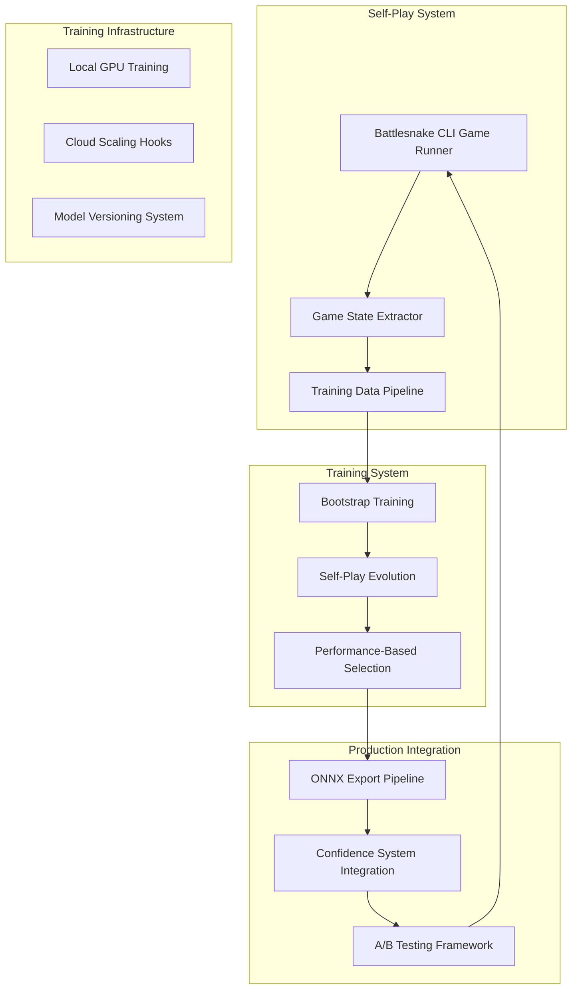

# Self-Play Training Architecture for Neural Network Intelligence

## Executive Summary

This architecture transforms existing neural networks from meaningless placeholder outputs (~0.12 points) to genuinely intelligent systems contributing 20-50+ points to strategic decisions through automated self-play training. The design leverages 90% of existing infrastructure while adding the critical missing component: automated game experience generation.

## System Architecture Overview



## 1. Self-Play Automation System Architecture

### 1.1 Battlesnake CLI Game Runner

**Core Component**: `BattlesnakeGameOrchestrator`

**Architecture**:
```python
class BattlesnakeGameOrchestrator:
    def __init__(self, config: GameOrchestratorConfig):
        self.server_pool = ServerPool(max_concurrent=4)
        self.game_scheduler = GameScheduler()
        self.data_collector = GameDataCollector()
        self.performance_monitor = PerformanceMonitor()
    
    async def run_training_session(self, num_games: int) -> TrainingSession:
        # Spawn multiple Rust servers on different ports
        # Run concurrent Battlesnake CLI games
        # Extract training data from each game
        # Aggregate results for training pipeline
```

**Game Execution Strategy**:
- **Multi-Server Deployment**: Spawn 4 concurrent Rust servers on ports 8000-8003
- **CLI Automation**: `battlesnake play -W 11 -H 11 --name 'Neural Snake' --url http://localhost:PORT --viewmap`
- **Game Variants**: Solo (learning), 2-snake (competition), 4-snake (complex scenarios)
- **Deterministic Seeding**: RNG seed control for reproducible training scenarios

**Game State Extraction Pipeline**:
```python
@dataclass
class GameStateCapture:
    turn: int
    board_state: np.ndarray  # 11x11x8 encoding
    snake_features: np.ndarray  # [health, length, position_x, position_y]
    available_moves: List[str]  # ["up", "down", "left", "right"]
    chosen_move: str
    heuristic_scores: Dict[str, float]  # Current system scores for supervision
    neural_scores: Dict[str, float]    # Neural network outputs
    game_context: Dict[str, Any]       # Turn, food count, alive snakes
```

### 1.2 Enhanced Board State Encoding

**Current System**: 7-channel encoding (EMPTY, OWN_HEAD, OWN_BODY, OPPONENT_HEAD, OPPONENT_BODY, FOOD, WALL)

**Enhanced System**: 12-channel strategic encoding
```python
ENHANCED_CHANNELS = {
    'EMPTY': 0,
    'OWN_HEAD': 1,
    'OWN_BODY': 2,
    'OWN_TAIL': 3,           # New: tail-specific channel for growth prediction
    'OPPONENT_HEAD': 4,
    'OPPONENT_BODY': 5,
    'OPPONENT_TAIL': 6,      # New: opponent tail tracking
    'FOOD': 7,
    'WALL': 8,
    'TERRITORY_CONTROL': 9,   # New: Voronoi territory ownership
    'DANGER_ZONES': 10,       # New: collision risk areas
    'STRATEGIC_VALUE': 11     # New: long-term positional value
}
```

**Multi-Resolution Encoding**: Add global context with attention mechanisms
- **Local View**: 11x11 detailed board state
- **Global Context**: Compressed game state (health ratios, length differences, food density)
- **Temporal Features**: Turn progression, game phase indicators

### 1.3 Training Data Format Evolution

**Enhanced Training Sample**:
```python
@dataclass
class EnhancedTrainingSample:
    # Core board state
    board_state: np.ndarray          # [11, 11, 12] - enhanced channels
    global_features: np.ndarray      # [32] - game-level strategic context
    
    # Temporal context
    game_phase: float                # [0,1] early/mid/late game indicator
    turn_normalized: float           # Turn / estimated game length
    
    # Strategic targets (from heuristic supervision)
    safety_score: float              # [-50, 0] safety evaluation
    territory_score: float           # [0, 9] territory control
    food_score: float               # [0, 11] food seeking value
    opponent_score: float           # [0, 6] opponent modeling
    
    # Learning targets
    position_value: float           # [-50, +50] unified position evaluation
    move_probabilities: np.ndarray  # [4] softmax distribution
    win_probability: float          # [0, 1] game outcome prediction
    
    # Ground truth
    actual_move: int                # 0-3 for up/down/left/right
    game_outcome: float            # 1.0=win, 0.5=draw, 0.0=loss
    moves_to_outcome: int          # Temporal credit assignment
```

## 2. Enhanced Neural Network Architectures

### 2.1 Advanced Position Evaluation Network

**Current Issue**: Shallow CNN producing ~0.12 constant outputs

**Enhanced Architecture**: Deep Residual CNN with Multi-Head Attention
```python
class EnhancedPositionEvaluationNetwork(nn.Module):
    def __init__(self):
        super().__init__()
        # Deeper CNN backbone with residual connections
        self.conv_backbone = ResidualCNNBackbone(
            input_channels=12,
            base_filters=64,
            num_residual_blocks=6,
            depth_multiplier=2
        )
        
        # Multi-head spatial attention
        self.spatial_attention = MultiHeadSpatialAttention(
            embed_dim=256,
            num_heads=8
        )
        
        # Strategic reasoning layers
        self.strategic_mlp = nn.Sequential(
            nn.Linear(256 + 32, 512),  # CNN features + global context
            nn.ReLU(),
            nn.Dropout(0.2),
            nn.Linear(512, 256),
            nn.ReLU(),
            nn.Linear(256, 1),
            nn.Tanh()  # Output range [-1, 1] mapped to [-50, +50]
        )
    
    def forward(self, board_state, global_features):
        # Extract spatial features
        spatial_features = self.conv_backbone(board_state)
        
        # Apply attention to focus on strategic positions
        attended_features = self.spatial_attention(spatial_features)
        
        # Combine with global context
        combined = torch.cat([attended_features, global_features], dim=1)
        
        # Strategic evaluation
        position_value = self.strategic_mlp(combined) * 50.0  # Scale to [-50, +50]
        return position_value
```

### 2.2 Advanced Move Prediction Network

**Enhancement**: Multi-scale CNN with game phase awareness
```python
class EnhancedMovePredictionNetwork(nn.Module):
    def __init__(self):
        super().__init__()
        # Multi-scale convolution for different strategic horizons
        self.short_term_cnn = ConvBlock(12, 64, kernel_size=3)  # Immediate tactics
        self.medium_term_cnn = ConvBlock(12, 64, kernel_size=5)  # Positional play
        self.long_term_cnn = ConvBlock(12, 64, kernel_size=7)   # Strategic planning
        
        # Game phase adaptation
        self.phase_adaptation = nn.Sequential(
            nn.Linear(1, 32),
            nn.ReLU(),
            nn.Linear(32, 192)  # Modulate combined CNN features
        )
        
        # Move prediction head
        self.move_predictor = nn.Sequential(
            nn.Linear(192 + 32, 256),  # Multi-scale + global features
            nn.ReLU(),
            nn.Dropout(0.2),
            nn.Linear(256, 128),
            nn.ReLU(),
            nn.Linear(128, 4),
            nn.Softmax(dim=1)
        )
    
    def forward(self, board_state, global_features, game_phase):
        # Multi-scale feature extraction
        short_features = self.short_term_cnn(board_state)
        medium_features = self.medium_term_cnn(board_state)
        long_features = self.long_term_cnn(board_state)
        
        combined_cnn = torch.cat([short_features, medium_features, long_features], dim=1)
        
        # Game phase modulation
        phase_modulation = self.phase_adaptation(game_phase.unsqueeze(1))
        modulated_features = combined_cnn * phase_modulation
        
        # Combine with global context
        final_features = torch.cat([modulated_features, global_features], dim=1)
        
        # Predict move probabilities
        move_probs = self.move_predictor(final_features)
        return move_probs
```

### 2.3 Performance Optimizations

**Target**: <10ms inference, <50MB memory per model

**Optimization Strategies**:
1. **Model Pruning**: Remove 30% of least important connections
2. **Quantization**: INT8 quantization for ONNX deployment
3. **Knowledge Distillation**: Compress large training models to compact inference models
4. **Efficient Convolutions**: Depthwise separable convolutions for mobile deployment

```python
class CompactInferenceModel(nn.Module):
    """Optimized for <10ms inference"""
    def __init__(self):
        super().__init__()
        # Depthwise separable convolutions
        self.efficient_backbone = DepthwiseSeparableCNN(
            input_channels=12,
            output_channels=128,
            num_layers=4
        )
        
        # Compact prediction heads
        self.position_head = nn.Linear(128, 1)
        self.move_head = nn.Linear(128, 4)
```

## 3. Bootstrap Training Strategy

### 3.1 Supervised Learning Phase

**Objective**: Learn current heuristic decision patterns as foundation

**Training Strategy**:
```python
class BootstrapTrainingConfig:
    num_games: int = 2000              # Comprehensive heuristic coverage
    heuristic_supervision_weight: float = 1.0
    neural_exploration_weight: float = 0.0
    
    # Multi-task learning weights
    position_loss_weight: float = 0.4
    move_loss_weight: float = 0.4
    outcome_loss_weight: float = 0.2
    
    # Curriculum learning
    difficulty_progression: List[str] = [
        "solo",           # Learn basic survival
        "2_snake",        # Learn competition
        "4_snake_easy",   # Learn complex scenarios
        "4_snake_hard"    # Learn advanced strategies
    ]
```

**Data Collection Process**:
1. **Phase 1** (500 games): Solo games with perfect heuristic supervision
2. **Phase 2** (750 games): 2-snake games focusing on opponent modeling
3. **Phase 3** (750 games): 4-snake games for complex strategic situations

**Supervision Signal Generation**:
```python
def generate_supervision_targets(game_state: GameState) -> SupervisionTargets:
    # Extract current heuristic scores
    safety_scores = safety_checker.evaluate_moves(game_state)
    territory_scores = space_controller.evaluate_moves(game_state)
    food_scores = food_seeker.evaluate_moves(game_state)
    opponent_scores = opponent_analyzer.evaluate_moves(game_state)
    
    # Unified position value = weighted sum of heuristic components
    position_value = (
        safety_scores.max() * 0.5 +      # Safety is critical
        territory_scores.max() * 0.2 +   # Territory expansion
        food_scores.max() * 0.2 +        # Food seeking
        opponent_scores.max() * 0.1      # Opponent modeling
    )
    
    # Move probabilities = softmax of heuristic move evaluations
    move_scores = np.array([
        evaluate_move(Direction.UP),
        evaluate_move(Direction.DOWN),
        evaluate_move(Direction.LEFT),
        evaluate_move(Direction.RIGHT)
    ])
    move_probabilities = softmax(move_scores / temperature)
    
    return SupervisionTargets(
        position_value=position_value,
        move_probabilities=move_probabilities
    )
```

### 3.2 Quality Assurance for Training Data

**Data Validation Pipeline**:
```python
class TrainingDataValidator:
    def validate_game_data(self, game_data: List[GameStateCapture]) -> bool:
        # Check for game diversity
        assert self.check_game_length_distribution(game_data)
        assert self.check_strategic_scenario_coverage(game_data)
        assert self.check_outcome_balance(game_data)  # Win/loss ratio
        
        # Validate supervision signals
        assert self.check_heuristic_consistency(game_data)
        assert self.check_move_safety_compliance(game_data)
        
        return True
    
    def check_strategic_scenario_coverage(self, game_data) -> bool:
        scenarios = {
            'early_game_expansion': 0,
            'food_competition': 0,
            'territory_control': 0,
            'endgame_survival': 0
        }
        # Ensure balanced coverage of all strategic scenarios
        return all(count > min_threshold for count in scenarios.values())
```

## 4. Self-Play Evolution Framework

### 4.1 Hybrid Training Transition

**Phase Progression**:
```python
class SelfPlayEvolutionConfig:
    phases = [
        # Phase 1: Pure Supervision
        TrainingPhase(
            name="bootstrap",
            supervision_weight=1.0,
            self_play_weight=0.0,
            num_games=2000
        ),
        
        # Phase 2: Gradual Self-Play Introduction
        TrainingPhase(
            name="hybrid_learning",
            supervision_weight=0.7,
            self_play_weight=0.3,
            num_games=3000
        ),
        
        # Phase 3: Self-Play Dominated
        TrainingPhase(
            name="self_play_evolution",
            supervision_weight=0.2,
            self_play_weight=0.8,
            num_games=5000
        ),
        
        # Phase 4: Pure Self-Play
        TrainingPhase(
            name="autonomous_learning",
            supervision_weight=0.0,
            self_play_weight=1.0,
            num_games=10000,
            continuous=True
        )
    ]
```

### 4.2 Performance-Driven Model Selection

**Model Evaluation Framework**:
```python
class ModelPerformanceEvaluator:
    def __init__(self):
        self.metrics = {
            'win_rate': WinRateMetric(),
            'average_game_length': GameLengthMetric(),
            'strategic_decision_quality': StrategicQualityMetric(),
            'confidence_calibration': ConfidenceCalibrationMetric()
        }
    
    async def evaluate_model(self, model_path: str) -> ModelPerformance:
        # Deploy model to test server
        test_server = await self.deploy_test_model(model_path)
        
        # Run evaluation games
        evaluation_results = await self.run_evaluation_games(
            test_server,
            num_games=200,
            opponents=['heuristic_baseline', 'previous_best_model']
        )
        
        # Calculate comprehensive performance metrics
        performance = ModelPerformance(
            win_rate=evaluation_results.win_rate,
            avg_game_length=evaluation_results.avg_game_length,
            strategic_quality=self.calculate_strategic_quality(evaluation_results),
            confidence_accuracy=self.calculate_confidence_calibration(evaluation_results)
        )
        
        return performance
    
    def calculate_strategic_quality(self, results) -> float:
        """Measure decision quality beyond just winning"""
        quality_metrics = [
            results.safety_compliance,      # Never made unsafe moves
            results.territory_efficiency,   # Effective space control
            results.food_optimization,      # Intelligent food seeking
            results.opponent_modeling       # Effective competitive play
        ]
        return np.mean(quality_metrics)
```

**Model Selection Criteria**:
1. **Win Rate**: >60% against heuristic baseline
2. **Strategic Quality**: Measurable improvement in decision quality
3. **Confidence Calibration**: Predicted outcomes match actual outcomes
4. **Performance Regression**: No degradation in critical safety metrics

### 4.3 Continuous Learning Loop

**Automated Training Pipeline**:
```python
class ContinuousLearningOrchestrator:
    async def run_continuous_training(self):
        while True:
            # Generate new training data
            new_games = await self.game_orchestrator.generate_games(
                current_model=self.current_best_model,
                num_games=500
            )
            
            # Update training dataset
            self.training_data.add_recent_games(new_games)
            self.training_data.maintain_diversity_balance()
            
            # Train new model candidate
            candidate_model = await self.train_model_candidate(
                training_data=self.training_data,
                base_model=self.current_best_model
            )
            
            # Evaluate candidate
            performance = await self.evaluator.evaluate_model(candidate_model)
            
            # Update if improved
            if performance.is_better_than(self.current_performance):
                await self.deploy_new_model(candidate_model)
                self.current_best_model = candidate_model
                self.current_performance = performance
            
            # Sleep before next iteration
            await asyncio.sleep(self.training_interval)
```

## 5. Training Infrastructure Architecture

### 5.1 Local Development Foundation

**Hardware Requirements**:
- **GPU**: NVIDIA RTX 3070+ (8GB+ VRAM) for local training
- **CPU**: 8+ cores for parallel game simulation
- **RAM**: 32GB for large training datasets
- **Storage**: 1TB SSD for game data and model checkpoints

**Local Training Setup**:
```python
class LocalTrainingInfrastructure:
    def __init__(self):
        self.gpu_manager = GPUResourceManager()
        self.data_manager = TrainingDataManager(max_size_gb=50)
        self.model_versioning = LocalModelVersioning(checkpoint_dir="./models/checkpoints")
        self.monitoring = LocalTrainingMonitor()
    
    def setup_training_environment(self):
        # Configure PyTorch for optimal local GPU usage
        torch.backends.cudnn.benchmark = True
        torch.multiprocessing.set_start_method('spawn')
        
        # Setup data pipeline with efficient loading
        self.data_loader = DataLoader(
            dataset=self.training_dataset,
            batch_size=32,
            num_workers=4,
            pin_memory=True,
            persistent_workers=True
        )
        
        # Configure model checkpointing
        self.checkpoint_callback = ModelCheckpoint(
            dirpath="./models/checkpoints",
            filename="{epoch}-{val_loss:.2f}-{win_rate:.3f}",
            monitor="win_rate",
            mode="max",
            save_top_k=5
        )
```

### 5.2 Cloud Scaling Hooks

**Architecture for Future Scaling**:
```python
class CloudScalingInterface:
    """Abstract interface for cloud deployment"""
    
    @abstractmethod
    async def scale_training_cluster(self, num_nodes: int) -> TrainingCluster:
        """Scale training infrastructure"""
        pass
    
    @abstractmethod
    async def distribute_game_generation(self, num_games: int) -> List[GameBatch]:
        """Distribute game generation across multiple nodes"""
        pass
    
    @abstractmethod
    async def store_training_artifacts(self, artifacts: TrainingArtifacts) -> str:
        """Store models and data in cloud storage"""
        pass

class AWSImplementation(CloudScalingInterface):
    """AWS-specific implementation for future scaling"""
    
    def __init__(self):
        self.ec2_manager = EC2TrainingClusterManager()
        self.s3_storage = S3ModelStorage()
        self.ecs_orchestrator = ECSGameOrchestrator()
    
    async def scale_training_cluster(self, num_nodes: int) -> TrainingCluster:
        # Launch EC2 instances with GPU support
        instances = await self.ec2_manager.launch_training_instances(
            instance_type="p3.2xlarge",  # V100 GPU instances
            num_instances=num_nodes
        )
        
        # Setup distributed training
        cluster = TrainingCluster(
            master_node=instances[0],
            worker_nodes=instances[1:],
            communication_backend="nccl"
        )
        
        return cluster
```

### 5.3 Model Versioning and Experiment Tracking

**Comprehensive Versioning System**:
```python
class ModelVersioningSystem:
    def __init__(self):
        self.git_lfs = GitLFSModelStorage()  # Large file support
        self.mlflow_tracking = MLflowExperimentTracker()
        self.metadata_db = ModelMetadataDatabase()
    
    def version_model(self, model: nn.Module, training_config: dict, performance: ModelPerformance) -> ModelVersion:
        # Generate model hash
        model_hash = self.calculate_model_hash(model)
        
        # Store model artifacts
        model_path = f"models/v{self.next_version_number()}/{model_hash}"
        self.git_lfs.store_model(model, model_path)
        
        # Track experiment
        experiment_id = self.mlflow_tracking.log_experiment(
            model_path=model_path,
            hyperparameters=training_config,
            metrics=performance.to_dict(),
            training_data_hash=self.training_data_hash
        )
        
        # Store metadata
        version = ModelVersion(
            version_number=self.next_version_number(),
            model_hash=model_hash,
            model_path=model_path,
            performance=performance,
            training_config=training_config,
            experiment_id=experiment_id,
            created_at=datetime.utcnow()
        )
        
        self.metadata_db.store_version(version)
        return version
```

## 6. Integration and Deployment System

### 6.1 Safe A/B Testing Framework

**Gradual Rollout Strategy**:
```python
class SafeNeuralNetworkDeployment:
    def __init__(self):
        self.confidence_system = EnhancedConfidenceSystem.global_instance()
        self.fallback_monitor = FallbackMonitor()
        self.performance_tracker = DeploymentPerformanceTracker()
    
    async def deploy_model_candidate(self, model_path: str) -> DeploymentResult:
        # Phase 1: Shadow deployment (0% traffic)
        shadow_deployment = await self.create_shadow_deployment(model_path)
        shadow_performance = await self.monitor_shadow_performance(shadow_deployment, duration_hours=4)
        
        if not shadow_performance.is_acceptable():
            return DeploymentResult.FAILED_SHADOW_TEST
        
        # Phase 2: Canary deployment (5% traffic)
        canary_deployment = await self.create_canary_deployment(model_path, traffic_percent=5)
        canary_performance = await self.monitor_canary_performance(canary_deployment, duration_hours=12)
        
        if not canary_performance.is_better_than_baseline():
            await self.rollback_canary_deployment(canary_deployment)
            return DeploymentResult.FAILED_CANARY_TEST
        
        # Phase 3: Gradual rollout (5% -> 25% -> 50% -> 100%)
        for traffic_percent in [25, 50, 100]:
            rollout_performance = await self.increase_traffic(canary_deployment, traffic_percent)
            if not rollout_performance.is_stable():
                await self.rollback_deployment(canary_deployment)
                return DeploymentResult.FAILED_ROLLOUT
        
        return DeploymentResult.SUCCESS
    
    async def monitor_canary_performance(self, deployment, duration_hours: int) -> PerformanceMetrics:
        metrics = PerformanceMetrics()
        
        start_time = datetime.utcnow()
        while (datetime.utcnow() - start_time).total_seconds() < duration_hours * 3600:
            # Monitor key safety metrics
            current_metrics = await self.collect_performance_metrics(deployment)
            
            # Check for performance degradation
            if current_metrics.win_rate < self.baseline_performance.win_rate * 0.95:
                # Immediate rollback if performance drops >5%
                await self.emergency_rollback(deployment)
                return PerformanceMetrics.FAILED
            
            # Check for safety violations
            if current_metrics.unsafe_moves > 0:
                # Zero tolerance for unsafe moves
                await self.emergency_rollback(deployment)
                return PerformanceMetrics.UNSAFE
            
            metrics.update(current_metrics)
            await asyncio.sleep(300)  # Check every 5 minutes
        
        return metrics
```

### 6.2 Confidence System Integration

**Enhanced Integration with Existing System**:
```python
class NeuralNetworkConfidenceIntegration:
    def __init__(self):
        self.confidence_calculator = UnifiedConfidenceCalculator()
        self.performance_history = NeuralPerformanceHistory()
        self.dynamic_thresholds = DynamicThresholdManager()
    
    def calculate_neural_confidence(self, neural_outputs: NeuralOutputs, game_state: GameState) -> float:
        """Enhanced confidence calculation that learns from performance"""
        
        # Base confidence from neural network uncertainty
        base_confidence = self.confidence_calculator.calculate_base_confidence(neural_outputs)
        
        # Performance-based confidence adjustment
        historical_performance = self.performance_history.get_performance_for_scenario(
            board_complexity=game_state.complexity_score(),
            game_phase=game_state.phase(),
            snake_count=len(game_state.snakes)
        )
        
        performance_modifier = historical_performance.confidence_modifier()
        
        # Dynamic threshold adjustment based on recent performance
        threshold_adjustment = self.dynamic_thresholds.get_adjustment(
            recent_performance=self.performance_history.recent_performance(),
            baseline_performance=self.heuristic_baseline_performance
        )
        
        # Final confidence calculation
        final_confidence = min(1.0, base_confidence * performance_modifier + threshold_adjustment)
        
        return final_confidence
    
    def should_use_neural_network(self, confidence: float, game_state: GameState) -> bool:
        """Intelligent routing between neural and heuristic systems"""
        
        # Never use neural networks for critical safety decisions with low confidence
        if game_state.is_critical_safety_situation() and confidence < 0.8:
            return False
        
        # Use adaptive thresholds based on game complexity
        complexity_threshold_map = {
            'simple': 0.3,      # Simple scenarios: lower threshold
            'medium': 0.5,      # Medium complexity: balanced threshold
            'complex': 0.7      # Complex scenarios: higher threshold
        }
        
        complexity = game_state.complexity_category()
        threshold = complexity_threshold_map[complexity]
        
        return confidence > threshold
```

### 6.3 Fallback and Safety Mechanisms

**Multi-Layer Safety Architecture**:
```python
class NeuralNetworkSafetySystem:
    def __init__(self):
        self.safety_validator = MoveSafetyValidator()
        self.fallback_hierarchy = FallbackHierarchy()
        self.emergency_override = EmergencyOverrideSystem()
    
    def safe_neural_decision(self, game_state: GameState) -> MoveDecision:
        try:
            # Attempt neural network inference
            neural_outputs = self.neural_inference_engine.predict(game_state)
            confidence = self.confidence_system.calculate_confidence(neural_outputs)
            
            # Check confidence threshold
            if confidence < self.minimum_confidence_threshold:
                return self.fallback_hierarchy.get_fallback_decision(game_state, reason="low_confidence")
            
            # Extract move decision
            recommended_move = neural_outputs.best_move()
            
            # MANDATORY safety validation - NEVER bypassed
            if not self.safety_validator.is_safe_move(recommended_move, game_state):
                return self.fallback_hierarchy.get_fallback_decision(game_state, reason="unsafe_move")
            
            # Log successful neural decision
            self.decision_logger.log_neural_decision(
                game_state=game_state,
                neural_outputs=neural_outputs,
                confidence=confidence,
                chosen_move=recommended_move
            )
            
            return MoveDecision(
                move=recommended_move,
                confidence=confidence,
                source="neural_network",
                fallback_available=True
            )
            
        except Exception as e:
            # Fallback on any neural network failure
            self.error_logger.log_neural_failure(e)
            return self.fallback_hierarchy.get_fallback_decision(game_state, reason=f"neural_error: {e}")
    
    def validate_deployment_safety(self, model_candidate: str) -> SafetyValidationResult:
        """Comprehensive safety testing before deployment"""
        
        safety_tests = [
            self.test_no_unsafe_moves(model_candidate),
            self.test_reasonable_confidence_calibration(model_candidate),
            self.test_fallback_integration(model_candidate),
            self.test_performance_under_stress(model_candidate)
        ]
        
        results = [await test() for test in safety_tests]
        
        return SafetyValidationResult(
            all_tests_passed=all(r.passed for r in results),
            test_results=results,
            deployment_approved=all(r.passed for r in results)
        )
```

## 7. Evaluation and Monitoring Framework

### 7.1 Comprehensive Performance Metrics

**Strategic Decision Quality Measurement**:
```python
class StrategicPerformanceAnalyzer:
    def __init__(self):
        self.heuristic_baseline = HeuristicPerformanceBaseline()
        self.strategic_analyzers = {
            'safety': SafetyAnalyzer(),
            'territory': TerritoryControlAnalyzer(),
            'food_efficiency': FoodSeekingAnalyzer(),
            'opponent_modeling': OpponentModelingAnalyzer()
        }
    
    def analyze_decision_quality(self, game_history: List[GameState], decisions: List[MoveDecision]) -> StrategicAnalysis:
        """Measure decision quality beyond win/loss"""
        
        analysis_results = {}
        
        for aspect, analyzer in self.strategic_analyzers.items():
            # Compare neural decisions to heuristic baseline
            neural_performance = analyzer.evaluate_decisions(decisions, game_history)
            baseline_performance = analyzer.evaluate_heuristic_baseline(game_history)
            
            improvement = neural_performance.score - baseline_performance.score
            
            analysis_results[aspect] = StrategicAspectAnalysis(
                neural_score=neural_performance.score,
                baseline_score=baseline_performance.score,
                improvement=improvement,
                improvement_percentage=improvement / baseline_performance.score * 100,
                statistical_significance=self.calculate_significance(
                    neural_performance.samples,
                    baseline_performance.samples
                )
            )
        
        return StrategicAnalysis(
            overall_improvement=np.mean([r.improvement for r in analysis_results.values()]),
            aspect_analysis=analysis_results,
            confidence_interval=self.calculate_confidence_interval(analysis_results)
        )
```

### 7.2 Real-Time Performance Monitoring

**Production Monitoring Dashboard**:
```python
class NeuralNetworkMonitoringDashboard:
    def __init__(self):
        self.metrics_collector = MetricsCollector()
        self.alerting_system = AlertingSystem()
        self.performance_dashboard = PerformanceDashboard()
    
    def setup_monitoring(self):
        # Key Performance Indicators
        self.kpis = {
            'neural_usage_rate': Gauge('neural_decisions_per_minute'),
            'confidence_distribution': Histogram('neural_confidence_scores'),
            'fallback_rate': Counter('fallback_decisions_total'),
            'inference_latency': Histogram('neural_inference_latency_ms'),
            'win_rate': Gauge('current_win_rate_percentage'),
            'safety_compliance': Gauge('unsafe_moves_per_hour')
        }
        
        # Alerting thresholds
        self.alerts = {
            'high_fallback_rate': Alert(
                condition='fallback_rate > 0.3',  # >30% fallback rate
                severity='warning',
                action='investigate_model_performance'
            ),
            'performance_degradation': Alert(
                condition='win_rate < baseline_win_rate * 0.95',  # >5% drop
                severity='critical',
                action='consider_rollback'
            ),
            'safety_violation': Alert(
                condition='unsafe_moves_per_hour > 0',  # Zero tolerance
                severity='critical',
                action='immediate_rollback'
            )
        }
    
    async def continuous_monitoring_loop(self):
        while True:
            # Collect current metrics
            current_metrics = await self.metrics_collector.collect_current_metrics()
            
            # Update dashboard
            self.performance_dashboard.update(current_metrics)
            
            # Check alert conditions
            triggered_alerts = self.alerting_system.check_alerts(current_metrics)
            
            for alert in triggered_alerts:
                await self.handle_alert(alert)
            
            await asyncio.sleep(60)  # Monitor every minute
    
    async def handle_alert(self, alert: Alert):
        if alert.severity == 'critical':
            if 'safety_violation' in alert.name:
                # Immediate emergency rollback
                await self.emergency_rollback_system.initiate_rollback()
            elif 'performance_degradation' in alert.name:
                # Schedule performance investigation
                await self.performance_investigator.schedule_investigation(alert)
        
        # Log alert and notify team
        self.alert_logger.log_alert(alert)
        await self.notification_system.notify_team(alert)
```

### 7.3 Continuous Model Improvement

**Automated Performance Analysis**:
```python
class ContinuousImprovementSystem:
    def __init__(self):
        self.performance_analyzer = PerformanceAnalyzer()
        self.model_optimizer = ModelOptimizer()
        self.a_b_tester = ABTestingFramework()
    
    async def weekly_performance_analysis(self):
        """Weekly analysis to identify improvement opportunities"""
        
        # Collect week's performance data
        weekly_data = await self.performance_analyzer.collect_weekly_data()
        
        # Identify underperforming scenarios
        weak_scenarios = self.performance_analyzer.identify_weak_scenarios(weekly_data)
        
        # Generate targeted training data
        for scenario in weak_scenarios:
            additional_training_data = await self.generate_targeted_training_data(scenario)
            self.training_data_manager.add_targeted_data(additional_training_data)
        
        # Train improved model candidate
        if len(weak_scenarios) > 0:
            improved_model = await self.model_optimizer.train_improved_model(
                focus_scenarios=weak_scenarios,
                training_data=self.training_data_manager.get_complete_dataset()
            )
            
            # Schedule A/B test for improved model
            ab_test = await self.a_b_tester.schedule_test(
                challenger=improved_model,
                champion=self.current_production_model,
                duration_days=3,
                traffic_split=0.1  # 10% challenger traffic
            )
            
            self.improvement_logger.log_improvement_attempt(
                weak_scenarios=weak_scenarios,
                model_candidate=improved_model,
                ab_test_id=ab_test.test_id
            )
```

## 8. Implementation Roadmap

### Phase 1: Self-Play Infrastructure (Weeks 1-2)
- **Week 1**: Implement BattlesnakeGameOrchestrator and CLI automation
- **Week 2**: Create enhanced board state encoding and training data pipeline

### Phase 2: Enhanced Neural Architectures (Weeks 3-4)
- **Week 3**: Implement deep residual CNN with attention mechanisms
- **Week 4**: Create compact inference models optimized for <10ms performance

### Phase 3: Bootstrap Training (Weeks 5-6)
- **Week 5**: Implement supervised learning pipeline with heuristic targets
- **Week 6**: Generate comprehensive training dataset and validate model performance

### Phase 4: Self-Play Evolution (Weeks 7-8)
- **Week 7**: Implement hybrid training with self-play transition
- **Week 8**: Create performance-driven model selection and continuous learning

### Phase 5: Production Integration (Weeks 9-10)
- **Week 9**: Implement safe A/B testing framework and deployment pipeline
- **Week 10**: Integrate with existing confidence system and validate safety mechanisms

### Phase 6: Monitoring and Optimization (Weeks 11-12)
- **Week 11**: Deploy comprehensive monitoring dashboard and alerting system
- **Week 12**: Implement continuous improvement system and performance optimization

## Success Metrics

### Quantitative Targets
- **Neural Contribution**: Increase from ~0.12 to 20-50+ points in decision making
- **Win Rate**: Achieve >65% win rate against heuristic baseline
- **Inference Speed**: Maintain <10ms inference time
- **Confidence Calibration**: Achieve >80% accuracy in confidence predictions
- **Safety Compliance**: Zero unsafe moves in production deployment

### Qualitative Improvements
- **Strategic Sophistication**: Demonstrate novel strategies not present in heuristic system
- **Adaptability**: Show improved performance against diverse opponent strategies
- **Robustness**: Maintain performance across different game scenarios and complexities
- **Integration Quality**: Seamless integration with existing confidence and fallback systems

This architecture transforms your existing sophisticated infrastructure into a complete self-play training system capable of creating genuinely intelligent neural networks that can rival and exceed your current heuristic systems.